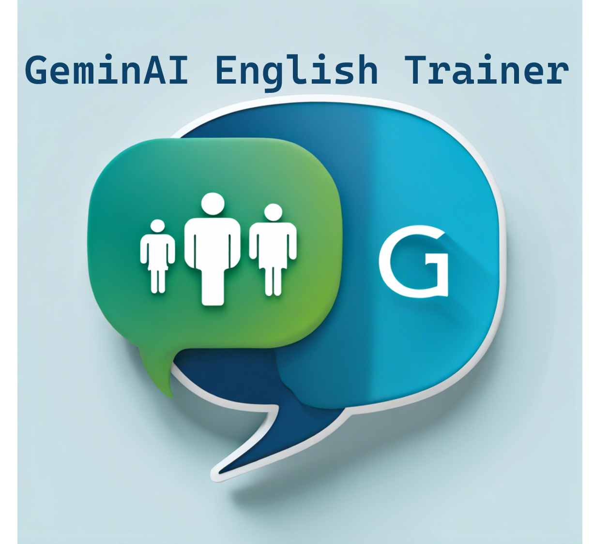

# GeminAi_English_Trainer
Welcome to our cutting-edge app designed to prepare you for English proficiency exams like never before. 

The GeminAi English Trainer App uses the Gemini generative artificial intelligence for teaching and learning English. Harnessing the power of generative artificial intelligence, we offer a comprehensive platform for targeted training and exam readiness. Whether you're aiming for certifications or seeking to enhance your language skills, our app provides a tailored learning experience that adapts to your needs and accelerates your progress. With interactive exercises, personalized feedback, and simulated exam environments, we empower you to confidently master the language and excel in your proficiency goals.

Welcome to GeminAi English Trainer, where cutting-edge technology meets English proficiency preparation like never before.

Our app utilizes the power of Gemini generative artificial intelligence to revolutionize the way you learn and teach English. Whether you're gearing up for certification exams or simply aiming to enhance your language skills, our platform offers a comprehensive suite of tools designed to meet your specific needs and accelerate your progress.

Experience interactive exercises, receive personalized feedback, and immerse yourself in simulated exam environments tailored to your proficiency level. With GeminAi English Trainer, you'll gain the confidence and skills needed to excel in your language goals.

Get ready to embark on a journey of language mastery like never before. Welcome to GeminAi English Trainer.
